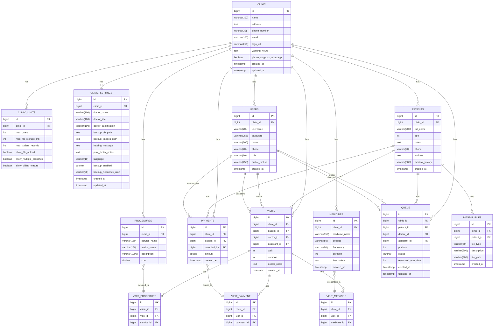
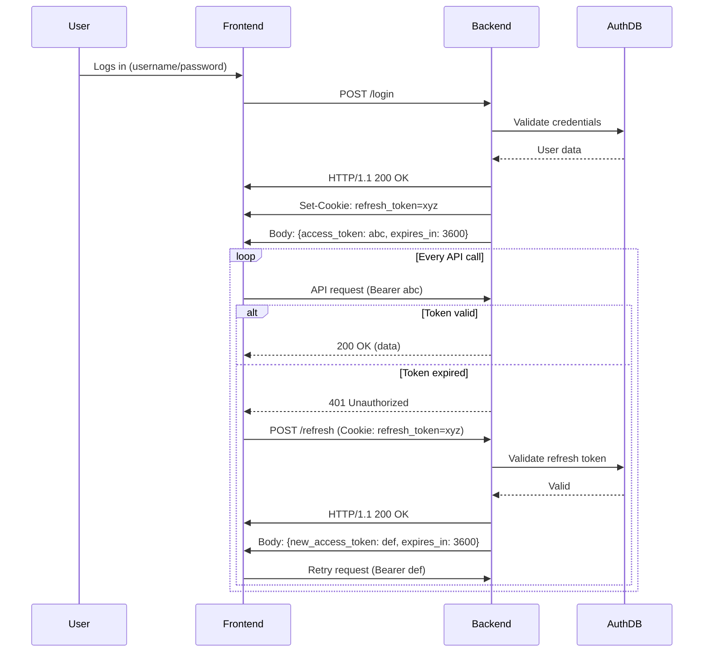
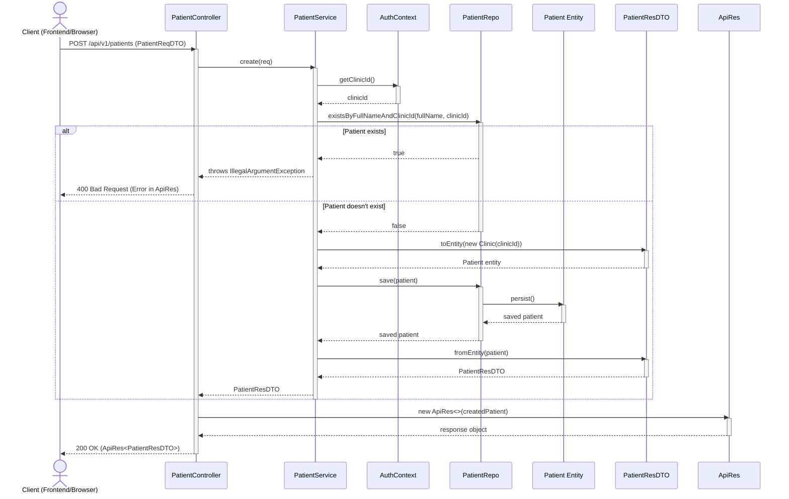

# Dental Clinic Management System

A dental clinic management system that allows a single doctor to manage multiple assistants, patients, services, payments and materials. The system tracks patient visits, prescriptions, and payments, providing a comprehensive solution for dental clinics.

# **Table of Contents**

1. [**Key Features and Explanations**](#key-features-and-explanations)
2. [**Database Design**](#database-design)

   - [**Users Table**](#1-users-table)
   - [**Patients Table**](#2-patients-table)
   - [**Services (Dental Procedures) Table**](#3-services-table)
   - [**Medicines Table**](#4-medicines-table)
   - [**Visits Table**](#5-visits-table)
   - [**Payments Table**](#6-payments-table)
   - [**Visit Payments Table**](#7-visit-payments-table)
   - [**Visit Services Table**](#8-visit-services-table)
   - [**Visit Medicines Table**](#9-visit-medicines-table)
   - [**Patient Files Table**](#10-patient-files-table)
   - [**Queue Table**](#11-queue-table)
   - [**Settings Table**](#12-settings-table)

3. [**Relationships**](#relationships)
4. [**Doctor Controls**](#doctor-controls)
5. [**Assistants Controls**](#assistants-controls)
6. [**Sequence Diagrams**](#sequence diagrams)

# **Key Features and Explanations**

1. **Single Doctor with Multiple Assistants**

   - Assistants have controlled permissions, managed by the doctor.

2. **Service Management**

   - The system includes a list of dental services (e.g., cleaning, root canal, etc.), which can be associated with patient visits.

3. **Prescription Auto-Generation**

   - When a doctor prescribes medicine, the system can automatically generate a prescription with details like dosage, frequency, and duration.

4. **Patient arrival synchronization**

   - Queue system tracks patient status (WAITING, IN_PROGRESS, COMPLETED)
   - Tracks estimated wait time and actual position in queue

5. **Patient Tracking**

   - Track patient details, including medical history, address, and notes.
   - Store patient files (medical tests, x-rays, etc.)

6. **Medicine Tracking**

   - Track all medicines prescribed to patients during visits.

7. **Payment Tracking**

   - Payments are linked to the user (doctor/assistant) who recorded them.

8. **Visit Tracking**
   - Each patient visit includes details like the patient, services provided, payment (if any), and visit date.

---

# **Database Design**

## **1. Clinic Table**

Core clinic information and settings.

| **Column Name**         | **Type**     | **Constraints**                          |
| ----------------------- | ------------ | ---------------------------------------- |
| id                      | BIGINT       | Primary Key, Auto-Increment              |
| name                    | VARCHAR(100) | NOT NULL                                 |
| address                 | TEXT         | NULLABLE                                 |
| phone_number            | VARCHAR(20)  | NULLABLE                                 |
| email                   | VARCHAR(100) | NULLABLE                                 |
| logo_url                | VARCHAR(255) | NULLABLE                                 |
| working_hours           | TEXT         | NULLABLE                                 |
| phone_supports_whatsapp | BOOLEAN      | DEFAULT FALSE                            |
| created_at              | TIMESTAMP    | DEFAULT CURRENT_TIMESTAMP, Not updatable |
| updated_at              | TIMESTAMP    | DEFAULT CURRENT_TIMESTAMP on update      |

## **2. ClinicLimits Table**

Clinic subscription limits and features.

| **Column Name**         | **Type** | **Constraints**                   |
| ----------------------- | -------- | --------------------------------- |
| id                      | BIGINT   | Primary Key, Auto-Increment       |
| clinic_id               | BIGINT   | Foreign Key -> Clinic(id), UNIQUE |
| max_users               | INT      | NULLABLE                          |
| max_file_storage_mb     | INT      | NULLABLE                          |
| max_patient_records     | INT      | NULLABLE                          |
| allow_file_upload       | BOOLEAN  | DEFAULT TRUE                      |
| allow_multiple_branches | BOOLEAN  | DEFAULT FALSE                     |
| allow_billing_feature   | BOOLEAN  | DEFAULT TRUE                      |

## **3. ClinicSettings Table**

Clinic-specific configurations.

| **Column Name**       | **Type**     | **Constraints**                          |
| --------------------- | ------------ | ---------------------------------------- |
| id                    | BIGINT       | Primary Key, Auto-Increment              |
| clinic_id             | BIGINT       | Foreign Key -> Clinic(id), UNIQUE        |
| doctor_name           | VARCHAR(100) | NULLABLE                                 |
| doctor_title          | VARCHAR(100) | NULLABLE                                 |
| doctor_qualification  | VARCHAR(100) | NULLABLE                                 |
| backup_db_path        | TEXT         | NULLABLE                                 |
| backup_images_path    | TEXT         | NULLABLE                                 |
| healing_message       | TEXT         | NULLABLE                                 |
| print_footer_notes    | TEXT         | NULLABLE                                 |
| language              | VARCHAR(10)  | DEFAULT 'en'                             |
| backup_enabled        | BOOLEAN      | DEFAULT FALSE                            |
| backup_frequency_cron | VARCHAR(20)  | NULLABLE                                 |
| created_at            | TIMESTAMP    | DEFAULT CURRENT_TIMESTAMP, Not updatable |
| updated_at            | TIMESTAMP    | DEFAULT CURRENT_TIMESTAMP on update      |

## **4. Users Table**

All system users with authentication.

| **Column Name** | **Type**     | **Constraints**                          |
| --------------- | ------------ | ---------------------------------------- |
| id              | BIGINT       | Primary Key, Auto-Increment              |
| clinic_id       | BIGINT       | Foreign Key -> Clinic(id), NOT NULL      |
| username        | VARCHAR(20)  | NOT NULL, UNIQUE, No spaces allowed      |
| password        | VARCHAR(255) | NOT NULL                                 |
| name            | VARCHAR(200) | NOT NULL                                 |
| phone           | VARCHAR(20)  | NOT NULL, UNIQUE                         |
| role            | VARCHAR(10)  | 'Admin','Doctor' or 'Assistant'          |
| profile_picture | VARCHAR(255) | NULLABLE                                 |
| created_at      | TIMESTAMP    | DEFAULT CURRENT_TIMESTAMP, Not updatable |

## **5. Patients Table**

Patient medical records.

| **Column Name** | **Type**     | **Constraints**                          |
| --------------- | ------------ | ---------------------------------------- |
| id              | BIGINT       | Primary Key, Auto-Increment              |
| clinic_id       | BIGINT       | Foreign Key -> Clinic(id), NOT NULL      |
| full_name       | VARCHAR(200) | NOT NULL, Clinic-scoped UNIQUE           |
| age             | INT          | NULLABLE                                 |
| notes           | TEXT         | NULLABLE                                 |
| phone           | VARCHAR(20)  | NOT NULL                                 |
| address         | TEXT         | NULLABLE                                 |
| medical_history | VARCHAR(500) | NULLABLE                                 |
| created_at      | TIMESTAMP    | DEFAULT CURRENT_TIMESTAMP, Not updatable |

## **6. PatientFiles Table**

Patient documents and attachments.

| **Column Name** | **Type**     | **Constraints**                          |
| --------------- | ------------ | ---------------------------------------- |
| id              | BIGINT       | Primary Key, Auto-Increment              |
| clinic_id       | BIGINT       | Foreign Key -> Clinic(id), NOT NULL      |
| patient_id      | BIGINT       | Foreign Key -> Patients(id), NOT NULL    |
| file_type       | VARCHAR(50)  | NOT NULL                                 |
| description     | VARCHAR(200) | NULLABLE                                 |
| file_path       | VARCHAR(300) | NULLABLE                                 |
| created_at      | TIMESTAMP    | DEFAULT CURRENT_TIMESTAMP, Not updatable |

## **7. Procedures Table**

Dental services offered.

| **Column Name** | **Type**      | **Constraints**                     |
| --------------- | ------------- | ----------------------------------- |
| id              | BIGINT        | Primary Key, Auto-Increment         |
| clinic_id       | BIGINT        | Foreign Key -> Clinic(id), NOT NULL |
| service_name    | VARCHAR(150)  | NOT NULL, UNIQUE                    |
| arabic_name     | VARCHAR(150)  | NOT NULL                            |
| description     | VARCHAR(1000) | NULLABLE                            |
| cost            | DOUBLE        | NOT NULL                            |

## **8. Medicines Table**

Prescription medications.

| **Column Name** | **Type**     | **Constraints**                          |
| --------------- | ------------ | ---------------------------------------- |
| id              | BIGINT       | Primary Key, Auto-Increment              |
| clinic_id       | BIGINT       | Foreign Key -> Clinic(id), NOT NULL      |
| medicine_name   | VARCHAR(150) | NOT NULL, UNIQUE                         |
| dosage          | VARCHAR(50)  | NOT NULL                                 |
| frequency       | VARCHAR(50)  | NOT NULL                                 |
| duration        | INT          | NOT NULL                                 |
| instructions    | TEXT         | NULLABLE                                 |
| created_at      | TIMESTAMP    | DEFAULT CURRENT_TIMESTAMP, Not updatable |

## **9. Visits Table**

Patient appointment records.

| **Column Name** | **Type**  | **Constraints**                          |
| --------------- | --------- | ---------------------------------------- |
| id              | BIGINT    | Primary Key, Auto-Increment              |
| clinic_id       | BIGINT    | Foreign Key -> Clinic(id), NOT NULL      |
| patient_id      | BIGINT    | Foreign Key -> Patients(id), NOT NULL    |
| doctor_id       | BIGINT    | Foreign Key -> Users(id), NOT NULL       |
| assistant_id    | BIGINT    | Foreign Key -> Users(id), NULLABLE       |
| wait            | INT       | NULLABLE (minutes)                       |
| duration        | INT       | NULLABLE (minutes)                       |
| doctor_notes    | TEXT      | NULLABLE                                 |
| created_at      | TIMESTAMP | DEFAULT CURRENT_TIMESTAMP, Not updatable |

## **10. Payments Table**

Financial transactions.

| **Column Name** | **Type**  | **Constraints**                          |
| --------------- | --------- | ---------------------------------------- |
| id              | BIGINT    | Primary Key, Auto-Increment              |
| clinic_id       | BIGINT    | Foreign Key -> Clinic(id), NOT NULL      |
| patient_id      | BIGINT    | Foreign Key -> Patients(id), NOT NULL    |
| recorded_by     | BIGINT    | Foreign Key -> Users(id), NOT NULL       |
| amount          | DOUBLE    | NOT NULL                                 |
| created_at      | TIMESTAMP | DEFAULT CURRENT_TIMESTAMP, Not updatable |

## **11. Queue Table**

Patient queue management.

| **Column Name**     | **Type**  | **Constraints**                          |
| ------------------- | --------- | ---------------------------------------- |
| id                  | BIGINT    | Primary Key, Auto-Increment              |
| clinic_id           | BIGINT    | Foreign Key -> Clinic(id), NOT NULL      |
| patient_id          | BIGINT    | Foreign Key -> Patients(id), NOT NULL    |
| doctor_id           | BIGINT    | Foreign Key -> Users(id), NOT NULL       |
| assistant_id        | BIGINT    | Foreign Key -> Users(id), NULLABLE       |
| position            | INT       | NOT NULL                                 |
| status              | VARCHAR   | WAITING/IN_PROGRESS/COMPLETED            |
| estimated_wait_time | INT       | NULLABLE (minutes)                       |
| created_at          | TIMESTAMP | DEFAULT CURRENT_TIMESTAMP, Not updatable |
| updated_at          | TIMESTAMP | DEFAULT CURRENT_TIMESTAMP on update      |

## **12. VisitProcedure Table**

Services performed during visits.

| **Column Name** | **Type** | **Constraints**                         |
| --------------- | -------- | --------------------------------------- |
| id              | BIGINT   | Primary Key, Auto-Increment             |
| clinic_id       | BIGINT   | Foreign Key -> Clinic(id), NOT NULL     |
| visit_id        | BIGINT   | Foreign Key -> Visits(id), NOT NULL     |
| service_id      | BIGINT   | Foreign Key -> Procedures(id), NOT NULL |

## **13. VisitMedicine Table**

Medications prescribed during visits.

| **Column Name** | **Type** | **Constraints**                        |
| --------------- | -------- | -------------------------------------- |
| id              | BIGINT   | Primary Key, Auto-Increment            |
| clinic_id       | BIGINT   | Foreign Key -> Clinic(id), NOT NULL    |
| visit_id        | BIGINT   | Foreign Key -> Visits(id), NOT NULL    |
| medicine_id     | BIGINT   | Foreign Key -> Medicines(id), NOT NULL |

## **14. VisitPayment Table**

Payments linked to visits.

| **Column Name** | **Type** | **Constraints**                       |
| --------------- | -------- | ------------------------------------- |
| id              | BIGINT   | Primary Key, Auto-Increment           |
| clinic_id       | BIGINT   | Foreign Key -> Clinic(id), NOT NULL   |
| visit_id        | BIGINT   | Foreign Key -> Visits(id), NOT NULL   |
| payment_id      | BIGINT   | Foreign Key -> Payments(id), NOT NULL |

# Entity Relationship Details

## 1. **User → Payment**

**Relationship:** One-to-Many  
**Description:**

- A **User** (with role `Admin`, `Doctor`, or `Assistant`) can record **multiple Payments** (`recorded_by` foreign key in `Payments` table).
- Each **Payment** is recorded by **exactly one User**.

## 2. **Patient → Visit**

**Relationship:** One-to-Many  
**Description:**

- A **Patient** can have **multiple Visits** (`patient_id` foreign key in `Visits` table).
- Each **Visit** belongs to **exactly one Patient**.

## 3. **Visit ↔ Services/Medicines/Payments**

**Relationship:** Many-to-Many (via junction tables)  
**Description:**

- **Visit ↔ Procedures**:
  - A **Visit** can include **multiple Procedures** (via `VisitProcedure` junction table).
  - A **Procedure** can be part of **multiple Visits**.
- **Visit ↔ Medicines**:
  - A **Visit** can prescribe **multiple Medicines** (via `VisitMedicine` junction table).
  - A **Medicine** can be prescribed in **multiple Visits**.
- **Visit ↔ Payments**: <!-- todo: One to One -->
  - A **Visit** can be linked to **multiple Payments** (via `VisitPayment` junction table).
  - A **Payment** can be linked to **multiple Visits** (e.g., partial payments for a single visit).

## 4. **Patient → Files**

**Relationship:** One-to-Many  
**Description:**

- A **Patient** can have **multiple Files** (`patient_id` foreign key in `PatientFiles` table).
- Each **File** belongs to **exactly one Patient**.

## 5. **Doctor (User) → Queue**

**Relationship:** One-to-Many  
**Description:**

- A **Doctor** (a `User` with role `Doctor`) can manage **multiple Queue entries** (`doctor_id` foreign key in `Queue` table).
- Each **Queue entry** is assigned to **exactly one Doctor**.

---

### Additional Key Relationships:

- **Clinic → All Tables**:
  - One-to-Many (e.g., a Clinic has multiple Users, Patients, Visits, etc.).
- **Assistant (User) → Queue**:
  - One-to-Many (an `Assistant` can assist in multiple Queue entries via `assistant_id`).
- **Patient → Queue**:
  - One-to-Many (a Patient can be in the Queue multiple times).

## Entity Relationship Diagram

---

# **Doctor Controls**

1. **User Management:**
   Full control over assistant accounts

2. **Service Management:**
   Add/update dental procedures with bilingual names

3. **Queue Management:**
   Monitor and update patient queue status

4. **Patient Records:**
   Access to complete medical history and files

# **Assistants Controls**

1. **Patient Registration:**
   Add new patients and update information

2. **Queue Management:**
   Add patients to queue and update basic status

3. **Payment Recording:**
   Record payments with doctor oversight

4. **Limited Access:**
   Restricted access based on doctor's settings

---

# **Sequence Diagrams**

## **1. Authentication Flow (Refresh Token API)**

## Patient Creation Flow:

Comprehensive sequence diagram for patient creation flow across all layers:

### Key components illustrated:

1. Flow Initiation:

   - Client makes POST request to PatientController

2. Validation Layer:

   - AuthContext provides clinicId for tenant isolation

   - Repository checks for existing patient name

3. Business Logic:

   - PatientReqDTO converts to Entity

   - Service handles uniqueness validation

4. Persistence:

   - PatientRepo saves the entity

   - Database-level constraints enforced

5. Response Formation:

   - Entity converts to PatientResDTO

   - Wrapped in standardized ApiRes format

6. Error Handling:

   - Duplicate name case shown in alt path

   - Returns 400 with error message

7. Success Flow:

   - Returns 200 with created patient data

The diagram shows:

- Clear layer separation (Controller → Service → Repository)

- DTO transformations

- Auth context integration

- Database interaction

- Response formatting
