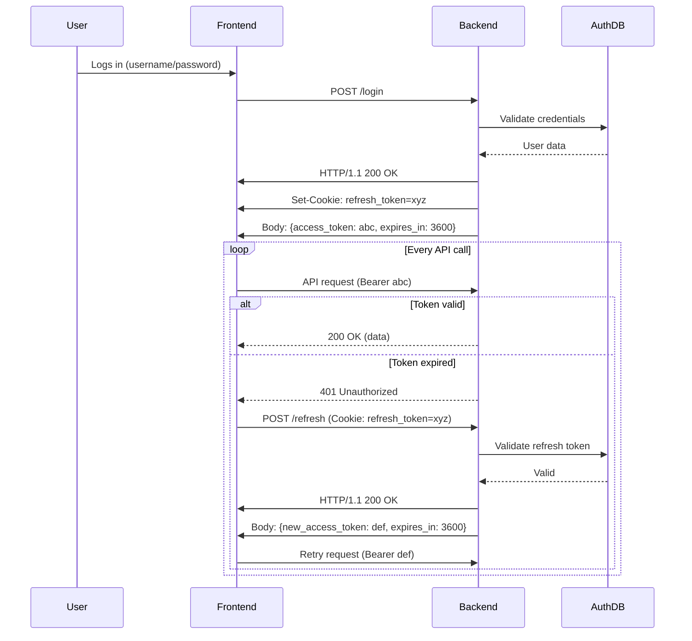
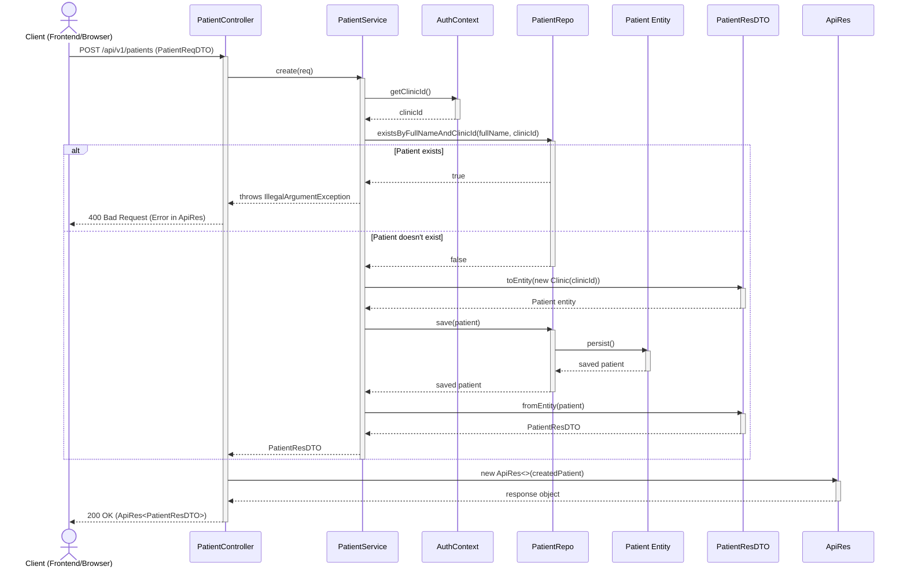

# Dental Clinic Management System

A dental clinic management system that allows a single doctor to manage multiple assistants, patients, services, payments and materials. The system tracks patient visits, prescriptions, and payments, providing a comprehensive solution for dental clinics.

# **Table of Contents**

1. [**Key Features and Explanations**](#key-features-and-explanations)
2. [**Database Design**](#database-design)

   - [**Users Table**](#1-users-table)
   - [**Patients Table**](#2-patients-table)
   - [**Services (Dental Procedures) Table**](#3-services-table)
   - [**Medicines Table**](#4-medicines-table)
   - [**Visits Table**](#5-visits-table)
   - [**Payments Table**](#6-payments-table)
   - [**Visit Payments Table**](#7-visit-payments-table)
   - [**Visit Services Table**](#8-visit-services-table)
   - [**Visit Medicines Table**](#9-visit-medicines-table)
   - [**Patient Files Table**](#10-patient-files-table)
   - [**Queue Table**](#11-queue-table)
   - [**Settings Table**](#12-settings-table)

3. [**Relationships**](#relationships)
4. [**Doctor Controls**](#doctor-controls)
5. [**Assistants Controls**](#assistants-controls)
6. [**Sequence Diagrams**](#sequence diagrams)

# **Key Features and Explanations**

1. **Single Doctor with Multiple Assistants**

   - Assistants have controlled permissions, managed by the doctor.

2. **Service Management**

   - The system includes a list of dental services (e.g., cleaning, root canal, etc.), which can be associated with patient visits.

3. **Prescription Auto-Generation**

   - When a doctor prescribes medicine, the system can automatically generate a prescription with details like dosage, frequency, and duration.

4. **Patient arrival synchronization**

   - Queue system tracks patient status (WAITING, IN_PROGRESS, COMPLETED)
   - Tracks estimated wait time and actual position in queue

5. **Patient Tracking**

   - Track patient details, including medical history, address, and notes.
   - Store patient files (medical tests, x-rays, etc.)

6. **Medicine Tracking**

   - Track all medicines prescribed to patients during visits.

7. **Payment Tracking**

   - Payments are linked to the user (doctor/assistant) who recorded them.

8. **Visit Tracking**
   - Each patient visit includes details like the patient, services provided, payment (if any), and visit date.

---

# **Database Design**

## **1. Users Table**

Stores all system users (doctor and assistants).

| **Column Name** | **Type**     | **Constraints**                          |
| --------------- | ------------ | ---------------------------------------- |
| id              | BIGINT       | Primary Key, Auto-Increment              |
| username        | VARCHAR(100) | NOT NULL, UNIQUE, No spaces allowed      |
| password        | VARCHAR(255) | NOT NULL                                 |
| name            | VARCHAR(200) | NOT NULL                                 |
| phone           | VARCHAR(20)  | NOT NULL, UNIQUE                         |
| role            | VARCHAR      | 'Doctor' or 'Assistant' (validated)      |
| profile_picture | VARCHAR(255) | NULLABLE                                 |
| created_at      | TIMESTAMP    | DEFAULT CURRENT_TIMESTAMP, Not updatable |

### **Explanation:**

- Uses Spring Security's `UserDetails` interface for authentication
- Phone and username are unique identifiers
- Role is validated to ensure only 'Doctor' or 'Assistant' values

## **2. Patients Table**

Stores patient information.

| **Column Name** | **Type**     | **Constraints**                          |
| --------------- | ------------ | ---------------------------------------- |
| id              | BIGINT       | Primary Key, Auto-Increment              |
| full_name       | VARCHAR(200) | NOT NULL, UNIQUE                         |
| age             | INT          | NULLABLE                                 |
| notes           | TEXT         | NULLABLE                                 |
| phone           | VARCHAR(20)  | NOT NULL                                 |
| address         | TEXT         | NULLABLE                                 |
| medical_history | VARCHAR(500) | NULLABLE                                 |
| created_at      | TIMESTAMP    | DEFAULT CURRENT_TIMESTAMP, Not updatable |

### **Explanation:**

- `full_name` must be unique
- `phone` is required but not unique (family members may share)
- `medical_history` limited to 500 characters

## **3. Services (Dental Procedures) Table**

Stores dental services provided by the clinic.

| **Column Name** | **Type**      | **Constraints**             |
| --------------- | ------------- | --------------------------- |
| id              | BIGINT        | Primary Key, Auto-Increment |
| service_name    | VARCHAR(150)  | NOT NULL, UNIQUE            |
| arabic_name     | VARCHAR(150)  | NOT NULL                    |
| description     | VARCHAR(1000) | NULLABLE                    |
| cost            | DOUBLE        | NOT NULL                    |

### **Explanation:**

- Contains both English and Arabic names for services
- Cost stored as DOUBLE precision

## **4. Medicines Table**

Stores all medicines prescribed by the doctor.

| **Column Name** | **Type**     | **Constraints**                          |
| --------------- | ------------ | ---------------------------------------- |
| id              | BIGINT       | Primary Key, Auto-Increment              |
| medicine_name   | VARCHAR(150) | NOT NULL, UNIQUE                         |
| dosage          | VARCHAR      | NOT NULL (e.g., "500 mg")                |
| frequency       | VARCHAR      | NOT NULL (e.g., "Twice a day")           |
| duration        | INT          | NOT NULL (e.g., 7 days)                  |
| instructions    | TEXT         | NULLABLE                                 |
| created_at      | TIMESTAMP    | DEFAULT CURRENT_TIMESTAMP, Not updatable |

## **5. Visits Table**

Tracks patient visits.

| **Column Name** | **Type**  | **Constraints**                          |
| --------------- | --------- | ---------------------------------------- |
| id              | BIGINT    | Primary Key, Auto-Increment              |
| patient_id      | BIGINT    | Foreign Key -> Patients(id), NOT NULL    |
| doctor_id       | BIGINT    | Foreign Key -> Users(id), NOT NULL       |
| assistant_id    | BIGINT    | Foreign Key -> Users(id), NULLABLE       |
| wait            | INT       | NULLABLE (wait time in minutes)          |
| duration        | INT       | NULLABLE (visit duration in minutes)     |
| doctor_notes    | TEXT      | NULLABLE                                 |
| created_at      | TIMESTAMP | DEFAULT CURRENT_TIMESTAMP, Not updatable |

## **6. Payments Table**

Tracks payments made by patients.

| **Column Name** | **Type**  | **Constraints**                          |
| --------------- | --------- | ---------------------------------------- |
| id              | BIGINT    | Primary Key, Auto-Increment              |
| patient_id      | BIGINT    | Foreign Key -> Patients(id), NOT NULL    |
| recorded_by     | BIGINT    | Foreign Key -> Users(id), NOT NULL       |
| amount          | DOUBLE    | NOT NULL                                 |
| created_at      | TIMESTAMP | DEFAULT CURRENT_TIMESTAMP, Not updatable |

## **7. Visit Payments Table**

Links payments to specific visits.

| **Column Name** | **Type** | **Constraints**                       |
| --------------- | -------- | ------------------------------------- |
| id              | BIGINT   | Primary Key, Auto-Increment           |
| visit_id        | BIGINT   | Foreign Key -> Visits(id), NOT NULL   |
| payment_id      | BIGINT   | Foreign Key -> Payments(id), NOT NULL |

## **8. Visit Services Table**

Links services to specific visits.

| **Column Name** | **Type** | **Constraints**                              |
| --------------- | -------- | -------------------------------------------- |
| id              | BIGINT   | Primary Key, Auto-Increment                  |
| visit_id        | BIGINT   | Foreign Key -> Visits(id), NOT NULL          |
| service_id      | BIGINT   | Foreign Key -> DentalProcedure(id), NOT NULL |

## **9. Visit Medicines Table**

Links medicines to specific visits.

| **Column Name** | **Type** | **Constraints**                        |
| --------------- | -------- | -------------------------------------- |
| id              | BIGINT   | Primary Key, Auto-Increment            |
| visit_id        | BIGINT   | Foreign Key -> Visits(id), NOT NULL    |
| medicine_id     | BIGINT   | Foreign Key -> Medicines(id), NOT NULL |

## **10. Patient Files Table**

Stores patient-related files (x-rays, medical tests, etc.).

| **Column Name** | **Type**     | **Constraints**                          |
| --------------- | ------------ | ---------------------------------------- |
| id              | BIGINT       | Primary Key, Auto-Increment              |
| patient_id      | BIGINT       | Foreign Key -> Patients(id), NOT NULL    |
| file_type       | VARCHAR(50)  | NOT NULL                                 |
| description     | VARCHAR(200) | NULLABLE                                 |
| file_path       | VARCHAR(300) | NULLABLE                                 |
| created_at      | TIMESTAMP    | DEFAULT CURRENT_TIMESTAMP, Not updatable |

## **11. Queue Table**

Manages patient queue for visits.

| **Column Name**     | **Type**  | **Constraints**                            |
| ------------------- | --------- | ------------------------------------------ |
| id                  | BIGINT    | Primary Key, Auto-Increment                |
| patient_id          | BIGINT    | Foreign Key -> Patients(id), NOT NULL      |
| doctor_id           | BIGINT    | Foreign Key -> Users(id), NOT NULL         |
| assistant_id        | BIGINT    | Foreign Key -> Users(id), NULLABLE         |
| position            | INT       | NOT NULL                                   |
| status              | VARCHAR   | NOT NULL (WAITING, IN_PROGRESS, COMPLETED) |
| estimated_wait_time | INT       | NULLABLE (minutes)                         |
| created_at          | TIMESTAMP | DEFAULT CURRENT_TIMESTAMP, Not updatable   |
| updated_at          | TIMESTAMP | DEFAULT CURRENT_TIMESTAMP on update        |

## **12. Settings Table**

| Column Name               | Data Type   | Description                                             |
| ------------------------- | ----------- | ------------------------------------------------------- |
| `id`                      | `INT` (PK)  | Unique identifier                                       |
| `clinic_name`             | `VARCHAR`   | Optional display name of the clinic                     |
| `doctor_id`               | `INT`       | Linked to the users table, marks head doctor            |
| `doctor_name`             | `VARCHAR`   | Shown on the prescription                               |
| `doctor_title`            | `VARCHAR`   | e.g. "أخصائي طب وجراحة الفم والأسنان"                   |
| `doctor_qualification`    | `VARCHAR`   | e.g. "القصر العيني"                                     |
| `clinic_address`          | `TEXT`      | Formatted address                                       |
| `clinic_phone_number`     | `VARCHAR`   | Displayed on prescription/footer                        |
| `clinic_email`            | `VARCHAR`   | Email for the clinic                                    |
| `working_hours`           | `TEXT`      | e.g. "يوميًا عدا الجمعة من 12 ظهرًا حتى 12 منتصف الليل" |
| `backup_db_path`          | `TEXT`      | Local backup path for DB                                |
| `backup_images_path`      | `TEXT`      | Path for image backup                                   |
| `prescription_logo_path`  | `TEXT`      | Logo to show on prescription                            |
| `healing_message`         | `TEXT`      | Custom footer message like "مع تمنياتنا بالشفاء العاجل" |
| `print_footer_notes`      | `TEXT`      | Any extra footer notes                                  |
| `language`                | `VARCHAR`   | Default UI language (e.g., 'ar', 'en')                  |
| `phone_supports_whatsapp` | `BOOLEAN`   | Whether the phone supports WhatsApp                     |
| `backup_duration_enabled` | `BOOLEAN`   | Whether the backup duration feature is enabled or not   |
| `backup_duration`         | `INT`       | Duration for backup frequency (e.g., hours or days)     |
| `created_at`              | `TIMESTAMP` | Record creation time                                    |
| `updated_at`              | `TIMESTAMP` | Last time this setting was updated                      |

---

# **Relationships**

1. **User → Payment:**  
   One-to-Many (User records payments)
2. **Patient → Visit:**  
   One-to-Many (Patient has multiple visits)

3. **Visit → Services/Medicines/Payments:**  
   Many-to-Many through junction tables

4. **Patient → Files:**  
   One-to-Many (Patient has multiple files)

5. **Doctor → Queue:**  
   One-to-Many (Doctor manages queue)

---

# **Doctor Controls**

1. **User Management:**  
   Full control over assistant accounts

2. **Service Management:**  
   Add/update dental procedures with bilingual names

3. **Queue Management:**  
   Monitor and update patient queue status

4. **Patient Records:**  
   Access to complete medical history and files

# **Assistants Controls**

1. **Patient Registration:**  
   Add new patients and update information

2. **Queue Management:**  
   Add patients to queue and update basic status

3. **Payment Recording:**  
   Record payments with doctor oversight

4. **Limited Access:**  
   Restricted access based on doctor's settings

---

The updated schema reflects all Java entities including:

- Added `PatientFile` entity for medical documents
- Enhanced `Queue` system with status tracking
- Bilingual service names in `DentalProcedure`
- Proper timestamp handling with `@CreationTimestamp` and `@UpdateTimestamp`
- Consistent BIGINT IDs across all tables
- Not nullable constraints matching entity annotations

# **Sequence Diagrams**

## **1. Authentication Flow (Refresh Token API)**

## Patient Creation Flow:

Comprehensive sequence diagram for patient creation flow across all layers:

### Key components illustrated:

1. Flow Initiation:

   - Client makes POST request to PatientController

2. Validation Layer:

   - AuthContext provides clinicId for tenant isolation

   - Repository checks for existing patient name

3. Business Logic:

   - PatientReqDTO converts to Entity

   - Service handles uniqueness validation

4. Persistence:

   - PatientRepo saves the entity

   - Database-level constraints enforced

5. Response Formation:

   - Entity converts to PatientResDTO

   - Wrapped in standardized ApiRes format

6. Error Handling:

   - Duplicate name case shown in alt path

   - Returns 400 with error message

7. Success Flow:

   - Returns 200 with created patient data

The diagram shows:

- Clear layer separation (Controller → Service → Repository)

- DTO transformations

- Auth context integration

- Database interaction

- Response formatting
