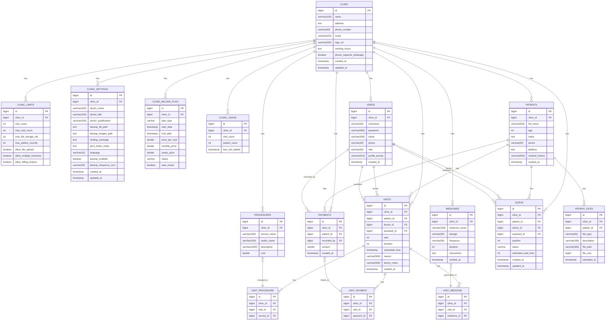
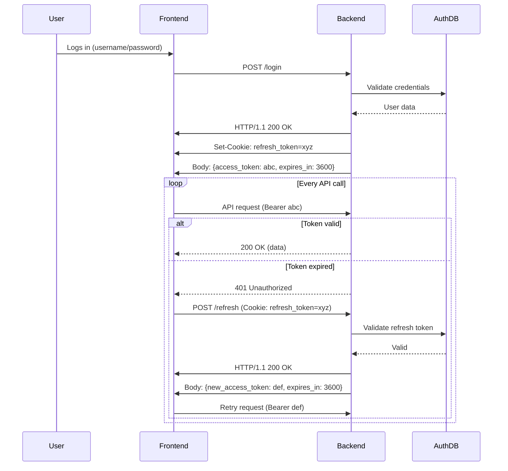
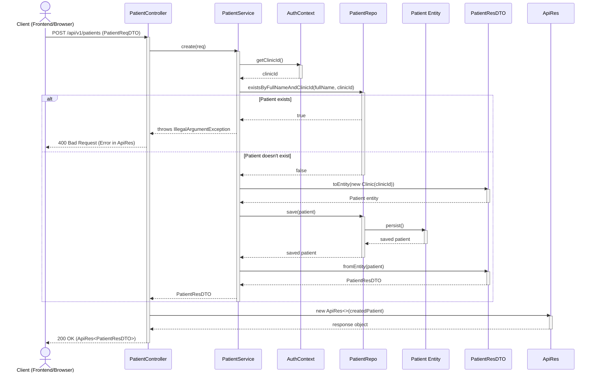

Here's the updated README with the new entities integrated:

# Dental Clinic Management System

A comprehensive multi-tenant clinic management platform that enables clinic owners to manage multiple doctors, assistants, patients, services, appointments, and payments. The system provides robust tracking of patient visits, prescriptions, payments, and generates detailed statistics. With SuperAdmin oversight for system-wide management, MediSoft-Solutions offers a complete practice management solution for dental clinics of all sizes.

# **Table of Contents**

1. [**Key Features and Explanations**](#key-features-and-explanations)
2. [**Database Design**](#database-design)

   - [**Clinic Table**](#1-clinic-table)
   - [**ClinicLimits Table**](#2-cliniclimits-table)
   - [**ClinicSettings Table**](#3-clinicsettings-table)
   - [**ClinicBillingPlan Table**](#4-clinicbillingplan-table)
   - [**ClinicUsage Table**](#5-clinicusage-table)
   - [**Users Table**](#6-users-table)
   - [**Patients Table**](#7-patients-table)
   - [**PatientFiles Table**](#8-patientfiles-table)
   - [**Procedures Table**](#9-procedures-table)
   - [**Medicines Table**](#10-medicines-table)
   - [**Visits Table**](#11-visits-table)
   - [**Payments Table**](#12-payments-table)
   - [**Queue Table**](#13-queue-table)
   - [**VisitProcedure Table**](#14-visitprocedure-table)
   - [**VisitMedicine Table**](#15-visitmedicine-table)
   - [**VisitPayment Table**](#16-visitpayment-table)

3. [**Relationships**](#relationships)
4. [**Doctor Controls**](#doctor-controls)
5. [**Assistants Controls**](#assistants-controls)
6. [**Sequence Diagrams**](#sequence-diagrams)

# **Key Features and Explanations**

## **Multi-Tenant Architecture**

- **Clinic-Based Isolation**: Each clinic operates in a fully isolated environment with separate data, users, and settings
- **Role-Based Access Control**: SuperAdmin, Clinic Owner, Doctor, Assistant with granular permissions
- **Scalable Structure**: Support for multiple clinics under single platform instance

## **User Management & Permissions**

- **Clinic Owners**: Full control over their clinic, can add multiple doctors and assistants
- **Doctors**: Manage patients, treatments, prescriptions within their assigned clinic
- **Assistants**: Limited permissions for patient registration, queue management, and payment recording
- **SuperAdmin**: System-wide control over all clinics, plans, limits, and customer support

## **Appointment & Scheduling System**

- **Flexible Scheduling**: Support for scheduled appointments and walk-in patients
- **Queue Management**: Real-time queue tracking with status (WAITING, IN_PROGRESS, COMPLETED)
- **Wait Time Estimation**: Intelligent wait time calculation based on historical data
- **Calendar Integration**: Visual scheduling interface for appointment management

## **Comprehensive Patient Management**

- **Medical Records**: Complete patient history, medical records, and treatment plans
- **File Management**: Secure storage of medical tests, x-rays, and patient documents
- **Treatment Tracking**: Detailed visit records with procedures, medications, and notes

## **Financial Management**

- **Payment Processing**: Track payments linked to specific visits and procedures
- **Billing Integration**: Support for multiple payment methods and invoice generation
- **Financial Reporting**: Revenue tracking and financial analytics

## **Prescription & Medication Management**

- **Auto-Generation**: Automatic prescription generation with dosage, frequency, and duration
- **Medicine Database**: Clinic-specific medication formulary
- **Prescription History**: Complete medication history for each patient

## **Analytics & Reporting**

- **Clinic Statistics**: Performance metrics, patient volume, revenue reports
- **Doctor Performance**: Individual doctor statistics and productivity metrics
- **Business Intelligence**: Trends analysis, peak hours, service popularity
- **Custom Reports**: Flexible reporting for business decision making

## **Subscription & Billing Management**

- **Flexible Plans**: Multiple subscription models (per-visit, monthly, yearly)
- **Usage Tracking**: Real-time monitoring of clinic usage against plan limits
- **Auto-Renewal**: Automated subscription management with renewal reminders
- **Plan Upgrades**: Seamless plan upgrades and feature management

---

# **Database Design**

## **1. Clinic Table**

Core clinic information and settings.

| **Column Name**         | **Type**     | **Constraints**                          |
| ----------------------- | ------------ | ---------------------------------------- |
| id                      | BIGINT       | Primary Key, Auto-Increment              |
| name                    | VARCHAR(100) | NOT NULL                                 |
| address                 | TEXT         | NULLABLE                                 |
| phone_number            | VARCHAR(20)  | NULLABLE                                 |
| email                   | VARCHAR(100) | NULLABLE                                 |
| logo_url                | VARCHAR(255) | NULLABLE                                 |
| working_hours           | TEXT         | NULLABLE                                 |
| phone_supports_whatsapp | BOOLEAN      | DEFAULT FALSE                            |
| created_at              | TIMESTAMP    | DEFAULT CURRENT_TIMESTAMP, Not updatable |
| updated_at              | TIMESTAMP    | DEFAULT CURRENT_TIMESTAMP on update      |

## **2. ClinicLimits Table**

Clinic subscription limits and features.

| **Column Name**         | **Type** | **Constraints**                   |
| ----------------------- | -------- | --------------------------------- |
| id                      | BIGINT   | Primary Key, Auto-Increment       |
| clinic_id               | BIGINT   | Foreign Key -> Clinic(id), UNIQUE |
| max_users               | INT      | NOT NULL                          |
| max_visit_count         | INT      | NOT NULL                          |
| max_file_storage_mb     | INT      | NOT NULL                          |
| max_patient_records     | INT      | NULLABLE                          |
| allow_file_upload       | BOOLEAN  | DEFAULT FALSE                     |
| allow_multiple_branches | BOOLEAN  | DEFAULT FALSE                     |
| allow_billing_feature   | BOOLEAN  | DEFAULT FALSE                     |

## **3. ClinicSettings Table**

Clinic-specific configurations.

| **Column Name**       | **Type**     | **Constraints**                          |
| --------------------- | ------------ | ---------------------------------------- |
| id                    | BIGINT       | Primary Key, Auto-Increment              |
| clinic_id             | BIGINT       | Foreign Key -> Clinic(id), UNIQUE        |
| doctor_name           | VARCHAR(100) | NULLABLE                                 |
| doctor_title          | VARCHAR(100) | NULLABLE                                 |
| doctor_qualification  | VARCHAR(100) | NULLABLE                                 |
| backup_db_path        | TEXT         | NULLABLE                                 |
| backup_images_path    | TEXT         | NULLABLE                                 |
| healing_message       | TEXT         | NULLABLE                                 |
| print_footer_notes    | TEXT         | NULLABLE                                 |
| language              | VARCHAR(10)  | NULLABLE                                 |
| backup_enabled        | BOOLEAN      | NULLABLE                                 |
| backup_frequency_cron | VARCHAR(20)  | NULLABLE                                 |
| created_at            | TIMESTAMP    | DEFAULT CURRENT_TIMESTAMP, Not updatable |
| updated_at            | TIMESTAMP    | DEFAULT CURRENT_TIMESTAMP on update      |

## **4. ClinicBillingPlan Table**

Clinic subscription and billing information.

| **Column Name** | **Type**  | **Constraints**                   |
| --------------- | --------- | --------------------------------- |
| id              | BIGINT    | Primary Key, Auto-Increment       |
| clinic_id       | BIGINT    | Foreign Key -> Clinic(id), UNIQUE |
| plan_type       | VARCHAR   | NOT NULL                          |
| start_date      | TIMESTAMP | NOT NULL                          |
| end_date        | TIMESTAMP | NULLABLE                          |
| price_per_visit | DOUBLE    | NOT NULL, DEFAULT 0.0             |
| monthly_price   | DOUBLE    | NOT NULL, DEFAULT 0.0             |
| yearly_price    | DOUBLE    | NOT NULL, DEFAULT 0.0             |
| status          | VARCHAR   | NOT NULL                          |
| auto_renew      | BOOLEAN   | NOT NULL                          |

## **5. ClinicUsage Table**

Clinic usage statistics and tracking.

| **Column Name**  | **Type**  | **Constraints**                   |
| ---------------- | --------- | --------------------------------- |
| id               | BIGINT    | Primary Key, Auto-Increment       |
| clinic_id        | BIGINT    | Foreign Key -> Clinic(id), UNIQUE |
| visit_count      | INT       | NOT NULL                          |
| patient_count    | INT       | NOT NULL                          |
| last_visit_added | TIMESTAMP | NULLABLE                          |

## **6. Users Table**

All system users with authentication.

| **Column Name** | **Type**     | **Constraints**                           |
| --------------- | ------------ | ----------------------------------------- |
| id              | BIGINT       | Primary Key, Auto-Increment               |
| clinic_id       | BIGINT       | Foreign Key -> Clinic(id), NULLABLE       |
| username        | VARCHAR(20)  | NOT NULL, UNIQUE, No spaces allowed       |
| password        | VARCHAR(255) | NOT NULL                                  |
| name            | VARCHAR(200) | NOT NULL                                  |
| phone           | VARCHAR(20)  | NOT NULL, UNIQUE                          |
| role            | VARCHAR(20)  | 'Doctor','Assistant','Admin','SuperAdmin' |
| profile_picture | VARCHAR(512) | NULLABLE                                  |
| created_at      | TIMESTAMP    | DEFAULT CURRENT_TIMESTAMP, Not updatable  |

## **7. Patients Table**

Patient medical records.

| **Column Name** | **Type**     | **Constraints**                          |
| --------------- | ------------ | ---------------------------------------- |
| id              | BIGINT       | Primary Key, Auto-Increment              |
| clinic_id       | BIGINT       | Foreign Key -> Clinic(id), NOT NULL      |
| full_name       | VARCHAR(200) | NOT NULL, Clinic-scoped UNIQUE           |
| age             | INT          | NULLABLE (0-120)                         |
| notes           | TEXT         | NULLABLE                                 |
| phone           | VARCHAR(20)  | NOT NULL                                 |
| address         | TEXT         | NULLABLE                                 |
| medical_history | VARCHAR(500) | NULLABLE                                 |
| created_at      | TIMESTAMP    | DEFAULT CURRENT_TIMESTAMP, Not updatable |

## **8. PatientFiles Table**

Patient documents and attachments.

| **Column Name** | **Type**     | **Constraints**                          |
| --------------- | ------------ | ---------------------------------------- |
| id              | BIGINT       | Primary Key, Auto-Increment              |
| clinic_id       | BIGINT       | Foreign Key -> Clinic(id), NOT NULL      |
| patient_id      | BIGINT       | Foreign Key -> Patients(id), NOT NULL    |
| file_type       | VARCHAR(50)  | NOT NULL                                 |
| description     | VARCHAR(200) | NULLABLE                                 |
| file_path       | VARCHAR(300) | NULLABLE                                 |
| file_size       | BIGINT       | NOT NULL                                 |
| uploaded_at     | TIMESTAMP    | DEFAULT CURRENT_TIMESTAMP, Not updatable |

## **9. Procedures Table**

Dental services offered.

| **Column Name** | **Type**      | **Constraints**                     |
| --------------- | ------------- | ----------------------------------- |
| id              | BIGINT        | Primary Key, Auto-Increment         |
| clinic_id       | BIGINT        | Foreign Key -> Clinic(id), NOT NULL |
| service_name    | VARCHAR(150)  | NOT NULL, UNIQUE                    |
| arabic_name     | VARCHAR(150)  | NOT NULL                            |
| description     | VARCHAR(1000) | NULLABLE                            |
| cost            | DOUBLE        | NOT NULL                            |

## **10. Medicines Table**

Prescription medications.

| **Column Name** | **Type**     | **Constraints**                          |
| --------------- | ------------ | ---------------------------------------- |
| id              | BIGINT       | Primary Key, Auto-Increment              |
| clinic_id       | BIGINT       | Foreign Key -> Clinic(id), NOT NULL      |
| medicine_name   | VARCHAR(150) | NOT NULL, Clinic-scoped UNIQUE           |
| dosage          | VARCHAR(50)  | NOT NULL                                 |
| frequency       | VARCHAR(50)  | NOT NULL                                 |
| duration        | INT          | NOT NULL (min 1)                         |
| instructions    | TEXT         | NULLABLE                                 |
| created_at      | TIMESTAMP    | DEFAULT CURRENT_TIMESTAMP, Not updatable |

## **11. Visits Table**

Patient appointment records.

| **Column Name** | **Type**     | **Constraints**                          |
| --------------- | ------------ | ---------------------------------------- |
| id              | BIGINT       | Primary Key, Auto-Increment              |
| clinic_id       | BIGINT       | Foreign Key -> Clinic(id), NOT NULL      |
| patient_id      | BIGINT       | Foreign Key -> Patients(id), NOT NULL    |
| doctor_id       | BIGINT       | Foreign Key -> Users(id), NOT NULL       |
| assistant_id    | BIGINT       | Foreign Key -> Users(id), NULLABLE       |
| wait            | INT          | NULLABLE (minutes)                       |
| duration        | INT          | NULLABLE (minutes)                       |
| scheduled_time  | TIMESTAMP    | NULLABLE                                 |
| reason          | VARCHAR(500) | NULLABLE                                 |
| doctor_notes    | VARCHAR(500) | NULLABLE                                 |
| created_at      | TIMESTAMP    | DEFAULT CURRENT_TIMESTAMP, Not updatable |

## **12. Payments Table**

Financial transactions.

| **Column Name** | **Type**  | **Constraints**                          |
| --------------- | --------- | ---------------------------------------- |
| id              | BIGINT    | Primary Key, Auto-Increment              |
| clinic_id       | BIGINT    | Foreign Key -> Clinic(id), NOT NULL      |
| patient_id      | BIGINT    | Foreign Key -> Patients(id), NOT NULL    |
| recorded_by     | BIGINT    | Foreign Key -> Users(id), NOT NULL       |
| amount          | DOUBLE    | NOT NULL (min 0)                         |
| created_at      | TIMESTAMP | DEFAULT CURRENT_TIMESTAMP, Not updatable |

## **13. Queue Table**

Patient queue management.

| **Column Name**     | **Type**  | **Constraints**                          |
| ------------------- | --------- | ---------------------------------------- |
| id                  | BIGINT    | Primary Key, Auto-Increment              |
| clinic_id           | BIGINT    | Foreign Key -> Clinic(id), NOT NULL      |
| patient_id          | BIGINT    | Foreign Key -> Patients(id), NOT NULL    |
| doctor_id           | BIGINT    | Foreign Key -> Users(id), NOT NULL       |
| assistant_id        | BIGINT    | Foreign Key -> Users(id), NULLABLE       |
| position            | INT       | NOT NULL (min 1)                         |
| status              | VARCHAR   | WAITING/IN_PROGRESS/COMPLETED            |
| estimated_wait_time | INT       | NULLABLE (minutes)                       |
| created_at          | TIMESTAMP | DEFAULT CURRENT_TIMESTAMP, Not updatable |
| updated_at          | TIMESTAMP | DEFAULT CURRENT_TIMESTAMP on update      |

## **14. VisitProcedure Table**

Services performed during visits.

| **Column Name** | **Type** | **Constraints**                         |
| --------------- | -------- | --------------------------------------- |
| id              | BIGINT   | Primary Key, Auto-Increment             |
| clinic_id       | BIGINT   | Foreign Key -> Clinic(id), NOT NULL     |
| visit_id        | BIGINT   | Foreign Key -> Visits(id), NOT NULL     |
| service_id      | BIGINT   | Foreign Key -> Procedures(id), NOT NULL |

## **15. VisitMedicine Table**

Medications prescribed during visits.

| **Column Name** | **Type** | **Constraints**                        |
| --------------- | -------- | -------------------------------------- |
| id              | BIGINT   | Primary Key, Auto-Increment            |
| clinic_id       | BIGINT   | Foreign Key -> Clinic(id), NOT NULL    |
| visit_id        | BIGINT   | Foreign Key -> Visits(id), NOT NULL    |
| medicine_id     | BIGINT   | Foreign Key -> Medicines(id), NOT NULL |

## **16. VisitPayment Table**

Payments linked to visits.

| **Column Name** | **Type** | **Constraints**                       |
| --------------- | -------- | ------------------------------------- |
| id              | BIGINT   | Primary Key, Auto-Increment           |
| clinic_id       | BIGINT   | Foreign Key -> Clinic(id), NOT NULL   |
| visit_id        | BIGINT   | Foreign Key -> Visits(id), NOT NULL   |
| payment_id      | BIGINT   | Foreign Key -> Payments(id), NOT NULL |

# Entity Relationship Details

## 1. **Clinic → All Entities**

**Relationship:** One-to-Many  
**Description:**

- A **Clinic** can have **multiple** associated entities (Users, Patients, Visits, etc.)
- Each entity belongs to **exactly one Clinic** (except SuperAdmin users)

## 2. **Clinic → Configuration Entities**

**Relationship:** One-to-One  
**Description:**

- **Clinic ↔ ClinicLimits**: Each clinic has one limits configuration
- **Clinic ↔ ClinicSettings**: Each clinic has one settings configuration
- **Clinic ↔ ClinicBillingPlan**: Each clinic has one billing plan
- **Clinic ↔ ClinicUsage**: Each clinic has one usage tracker

## 3. **User → Payment**

**Relationship:** One-to-Many  
**Description:**

- A **User** (with role `Admin`, `Doctor`, or `Assistant`) can record **multiple Payments** (`recorded_by` foreign key in `Payments` table).
- Each **Payment** is recorded by **exactly one User**.

## 4. **Patient → Visit**

**Relationship:** One-to-Many  
**Description:**

- A **Patient** can have **multiple Visits** (`patient_id` foreign key in `Visits` table).
- Each **Visit** belongs to **exactly one Patient**.

## 5. **Visit ↔ Services/Medicines/Payments**

**Relationship:** Many-to-Many (via junction tables)  
**Description:**

- **Visit ↔ Procedures**:
  - A **Visit** can include **multiple Procedures** (via `VisitProcedure` junction table).
  - A **Procedure** can be part of **multiple Visits**.
- **Visit ↔ Medicines**:
  - A **Visit** can prescribe **multiple Medicines** (via `VisitMedicine` junction table).
  - A **Medicine** can be prescribed in **multiple Visits**.
- **Visit ↔ Payments**:
  - A **Visit** can be linked to **multiple Payments** (via `VisitPayment` junction table).
  - A **Payment** can be linked to **multiple Visits** (e.g., partial payments for a single visit).

## 6. **Patient → Files**

**Relationship:** One-to-Many  
**Description:**

- A **Patient** can have **multiple Files** (`patient_id` foreign key in `PatientFiles` table).
- Each **File** belongs to **exactly one Patient**.

## 7. **Doctor (User) → Queue**

**Relationship:** One-to-Many  
**Description:**

- A **Doctor** (a `User` with role `Doctor`) can manage **multiple Queue entries** (`doctor_id` foreign key in `Queue` table).
- Each **Queue entry** is assigned to **exactly one Doctor**.

---

### Additional Key Relationships:

- **Assistant (User) → Queue**:
  - One-to-Many (an `Assistant` can assist in multiple Queue entries via `assistant_id`).
- **Patient → Queue**:
  - One-to-Many (a Patient can be in the Queue multiple times).

## Entity Relationship Diagram

---

# **User Roles & Permissions**

## **SuperAdmin**

- **System Management**: Full control over entire platform
- **Clinic Management**: Create, view, update, and suspend clinics
- **Plan Management**: Define and update subscription plans and pricing
- **Limits Configuration**: Set system-wide limits and features
- **Customer Support**: Access to all clinics for support purposes
- **Analytics**: System-wide analytics and performance reports
- **User Management**: Manage all users across all clinics

## **Clinic Owner**

- **Clinic Configuration**: Manage clinic settings, working hours, and preferences
- **Staff Management**: Add, remove, and manage doctors and assistants
- **Financial Oversight**: View financial reports and revenue analytics
- **Plan Management**: Upgrade/downgrade subscription plans
- **Patient Management**: Full access to all patient records and history
- **Appointment Scheduling**: Manage clinic schedule and appointments
- **Performance Monitoring**: View clinic statistics and staff performance

## **Doctor**

- **Patient Care**: Manage patient treatments, diagnoses, and prescriptions
- **Appointment Management**: View and manage personal appointment schedule
- **Medical Records**: Access and update patient medical history
- **Prescription Authority**: Prescribe medications and treatments
- **Queue Management**: Manage personal patient queue
- **Treatment Planning**: Create and update treatment plans
- **Limited Analytics**: Personal performance statistics

## **Assistant**

- **Patient Registration**: Register new patients and update information
- **Queue Management**: Add patients to queue and update status
- **Payment Processing**: Record payments and generate receipts
- **Appointment Scheduling**: Schedule appointments for doctors
- **Basic Operations**: Limited access to patient records and clinic functions
- **File Management**: Upload and manage patient documents

---

# **Sequence Diagrams**

## **1. Authentication Flow (Refresh Token API)**

## Patient Creation Flow:

Comprehensive sequence diagram for patient creation flow across all layers:

### Key components illustrated:

1. Flow Initiation:

   - Client makes POST request to PatientController

2. Validation Layer:

   - AuthContext provides clinicId for tenant isolation

   - Repository checks for existing patient name

3. Business Logic:

   - PatientReqDTO converts to Entity

   - Service handles uniqueness validation

4. Persistence:

   - PatientRepo saves the entity

   - Database-level constraints enforced

5. Response Formation:

   - Entity converts to PatientResDTO

   - Wrapped in standardized ApiRes format

6. Error Handling:

   - Duplicate name case shown in alt path

   - Returns 400 with error message

7. Success Flow:

   - Returns 200 with created patient data

The diagram shows:

- Clear layer separation (Controller → Service → Repository)

- DTO transformations

- Auth context integration

- Database interaction

- Response formatting

## **Key Updates Made:**

1. **Added new entities**:

   - `ClinicBillingPlan` - Subscription and billing management
   - `ClinicUsage` - Usage tracking and statistics
   - Updated `ClinicLimits` and `ClinicSettings` with correct field names

2. **Enhanced multi-tenant architecture**:

   - All entities now include `clinic_id` for data isolation
   - Support for SuperAdmin users with null clinic_id

3. **Updated constraints and relationships**:

   - Added proper validation constraints from entity annotations
   - Updated field types and sizes based on entity definitions
   - Added unique constraints for clinic-scoped uniqueness

4. **Improved billing and subscription features**:

   - Multiple pricing models (per-visit, monthly, yearly)
   - Usage tracking with visit and patient counts
   - Subscription status and auto-renewal management

5. **Enhanced data integrity**:
   - Added file size tracking for PatientFiles
   - Age validation constraints (0-120)
   - Proper role enumeration with SuperAdmin support

The system now provides a comprehensive multi-tenant dental clinic management solution with robust subscription management, usage tracking, and proper data isolation between clinics.
